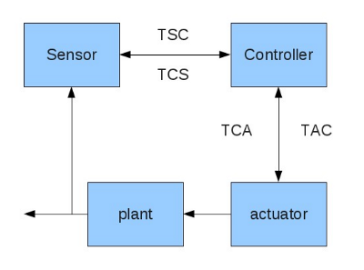

Architecture
============

The project *Khepera_simulation* is a multi-agent system following the *Networked Control System*.

A NCS is composed by 3 main components:

- Sensor
- Controller
- Actuator

In a multi-agent context, each of these components are implemented as an agent.

Sensor - Controller - Actuator
------------------------------

The logical architecture is the same one than a classic *Networked Control System*

Architecture:

- the sensor measures some criteria
- the sensor sends it to teh controller
- the controller decides an action to execute
- the controller sends its decision to the actuator
- the actuator executes the actions
