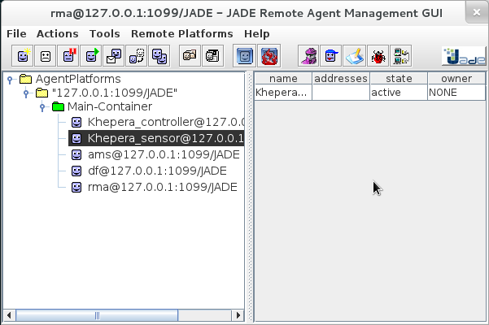
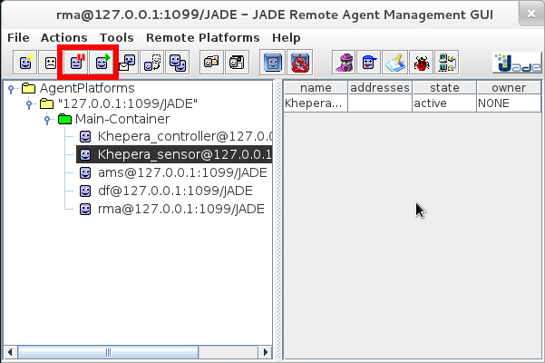
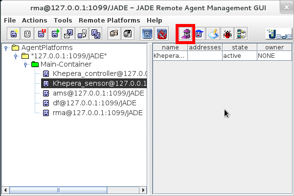
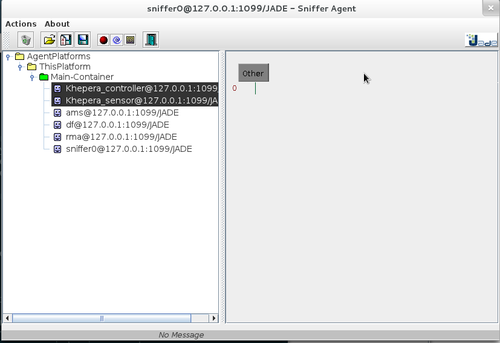
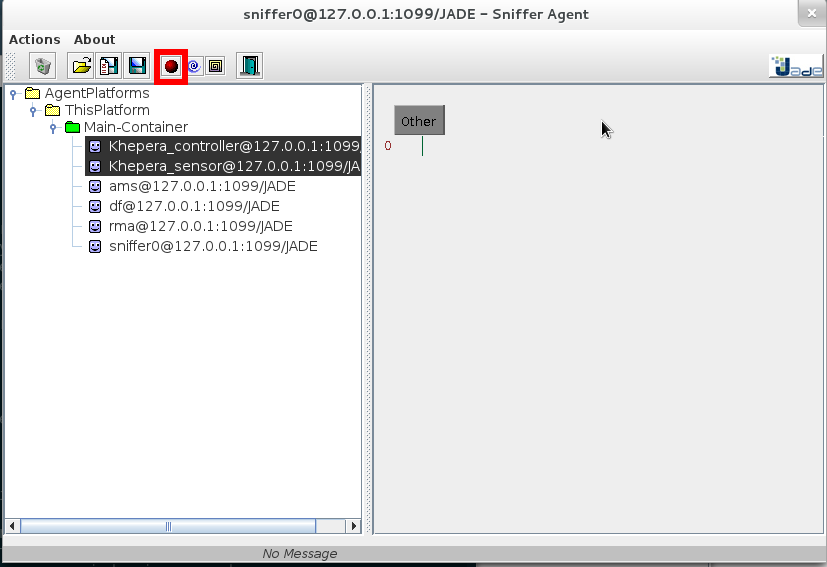
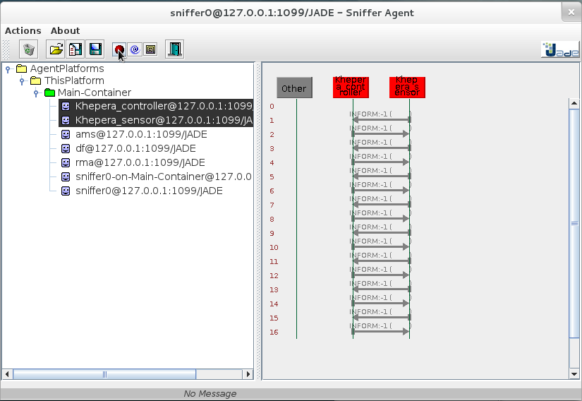
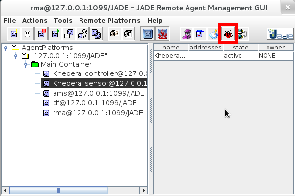
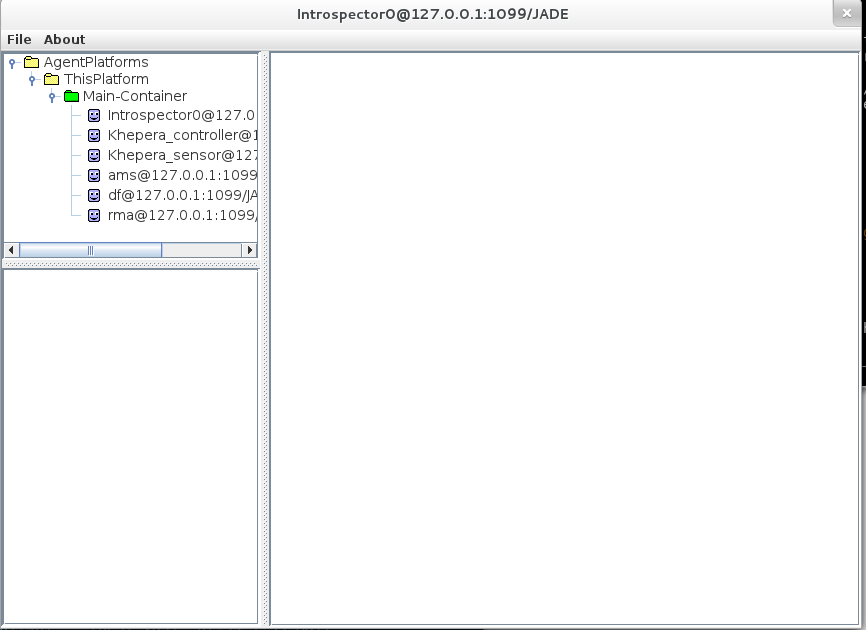
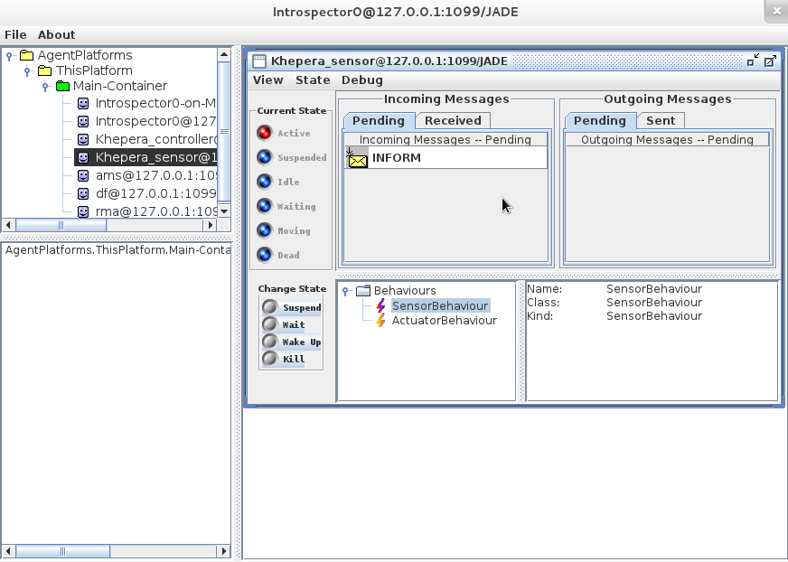
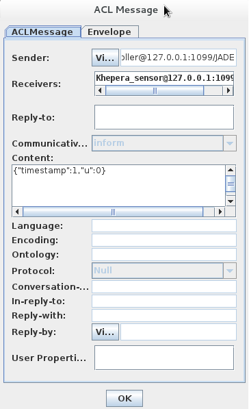

Jade: Graphical User Interface
==============================

The Jade framework offer several features about agents management and
agents observations.

In this chapter we will see how to use this interface to manage and to
inspect our system.

GUI
---

The GUI is launched automatically when the simulation is launched.
It offers several actions to control and observe the multi-agents
system.

Stop / Resume
-------------

One of the basic features of the GUI is to suspend and resume the
execution of one agent.

In our case, all the system react to the execution of the sensor agent
(if the sensor doesn't do anything, nothing happens).

So we can stop the sensor agent to stop all the system, so we have
time to observe and study the state of the system.

Sniffing
--------

The GUI provides some features to study the interraction between
several agents.
The sniffing is one of those.

The activation of the sniffing feature create a "sniffer" agent which
will record the messages sent by the other agents.

On the activation of sniffing, a new window is openned.

In this window, we can select the agents we want to observe and then
click on "do sniff this agent(s)".

Here we are able to see the messages exchanged by the different agents.

Introspection
-------------

The introspection feature allow us to focus on a given agent, to study its internal state and to examinate the messages it send and it receive.

First of all: enable the introspection mode:

The "introspection window" is openned

Then, we have to select the agent we want to inspect (right click + "debug on"):

Here we have a lot of tools to manage an agent and to study its
behaviour.

We are able to suspend/resume it, to slow it, to modify its behaviour,
to check the messages it sends and the messages it receives.

To study a message, we can right click on it and chose "view message".

Other
-----

The Jade Graphical User Interface offers a lot more possibilities.
Please, browse the Jade official documentation for more details. 
