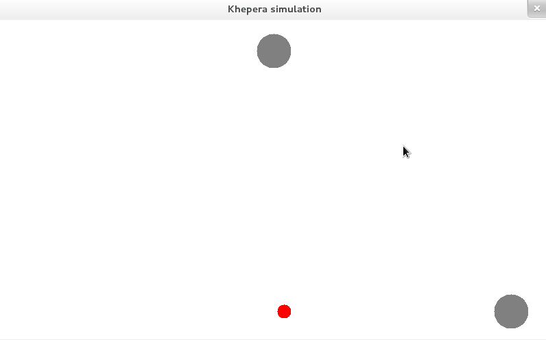
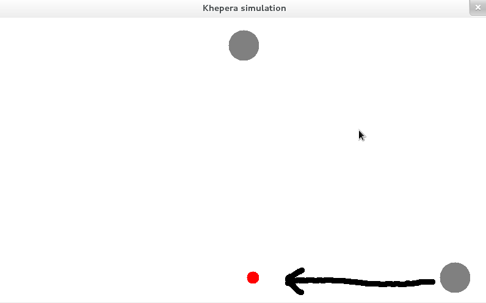
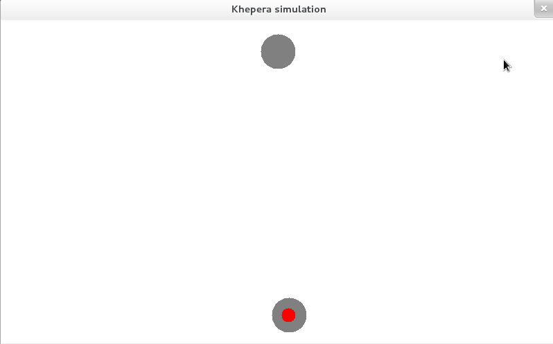

Simulation
==========

The goal of this project is to simulate the behaviour of some Khepera
robots where each robot is an agent which will interract with other
agents to achieve a given goal.

Simulation goal
---------------

To simplify the simulation I chose a simple goal.

We have two Khepera agents:

- a sensor/actuator agent
- a controller agent

On the top fo the window, there is the controller agent, and the
bottom, there is the sensor/actuator agent.

The goal of the system is to move the sensor/actuator agent to the
destination point (in red).

Simulation progress
-------------------

- The sensor measures the distance between the sensor/actuator agent, then it sends it to the controller agent.
- The controller agent decide the movement to make (which direction? how long?) and sends it to the actuator.
- The actuator move and get closer to the destination point.
- The cycle start again.

Simulation end
--------------

The goal is reached:

