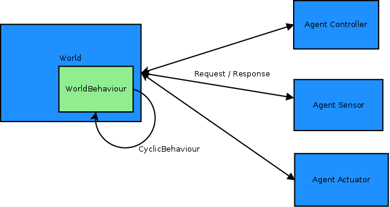

World
=====

The agent **World** is a representation of the physical world.

It's implemented as an agent, because this way allow every other
agents to send request to it (is there something in this direction ?
Is this place free ? Where is this element ? I moove there.) and it
can be accessed concurently without having to manage the traditionnal
concurrency issue (no need to use lock, mutex or whatever). It
simplify the programming.

Simulation
----------

This object is relevant only in the perspective of a simulation. When
the algorithm will be implemented for real application, it will be
useless to implement such an object because the world will be
modelized by the real world and it will be accessed by using
measurement from sensors (infra-red sensor, ultra-sound sensor, ...).

Functionning
------------

The **World** is an unique agent (only one instance) which maintain a
memory representation of the world.

How to request it
-----------------

The world is using JSON as message format, like every other objects in
**Khepera simulation**.

A message contain *at least* one field *request_type*. The others
fields may vary according to the *request_type* field.

The **World** will answer with a message with the same structure than the request plus some additionnals fields wich contain the answer.

Example:
Request: ``{"request_type": "GET_POSITION", "AID": "..."}`` => Answer: ``{"request_type": "GET_POSITION", "AID": "...", "x": 5, "y": 7}``
